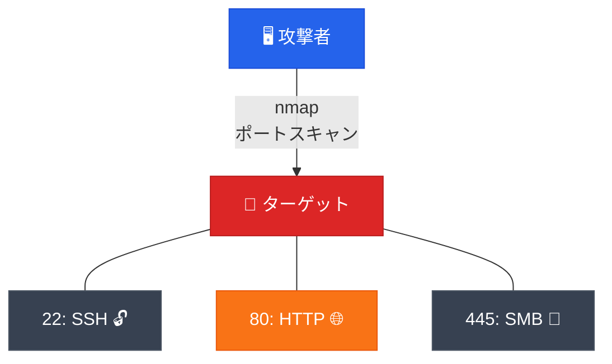
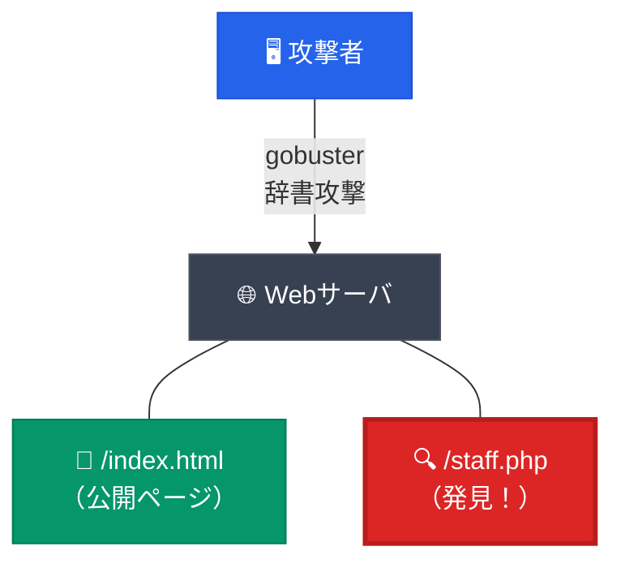
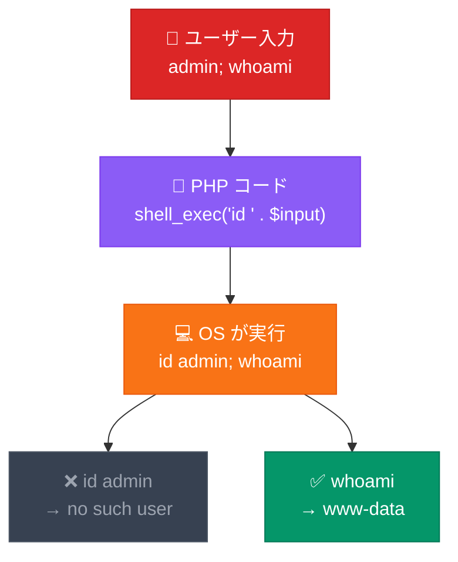
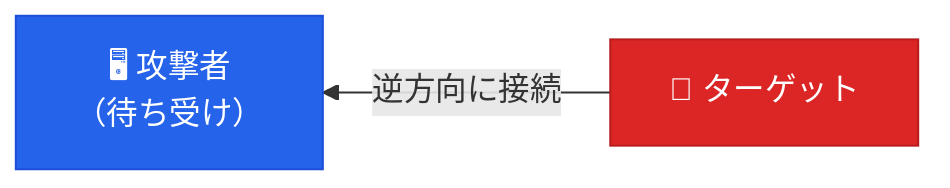

# きが件セキュリティデモ 


<div class="pt-12">
  <span class="px-2 py-1 rounded text-sm" style="background: rgba(0,0,0,0.4);">
    サイバー攻撃の流れを知る
  </span>
</div>

<div class="abs-br m-6 flex gap-2">
  <span class="text-sm opacity-50">第1回</span>
</div>

<!--
本日のセキュリティデモの導入スライドです。
-->

---
transition: fade-out
---

# 本日の目的

<div class="grid grid-cols-3 gap-6 mt-8">

<v-clicks>

<div class="p-5 rounded-lg" style="background: rgba(59,130,246,0.1); border: 1px solid rgba(59,130,246,0.3);">
  <div class="text-3xl mb-3">🔍</div>
  <div class="font-bold text-lg">攻撃の流れを体験</div>
  <div class="text-sm opacity-70 mt-2">攻撃者の侵入プロセスを<br>実際に見て理解する</div>
</div>

<div class="p-5 rounded-lg" style="background: rgba(239,68,68,0.1); border: 1px solid rgba(239,68,68,0.3);">
  <div class="text-3xl mb-3">💉</div>
  <div class="font-bold text-lg">脆弱性の例を知ってもらう</div>
  <div class="text-sm opacity-70 mt-2">OSコマンドインジェクション<br>リバースシェル</div>
</div>

<div class="p-5 rounded-lg" style="background: rgba(5,150,105,0.1); border: 1px solid rgba(5,150,105,0.3);">
  <div class="text-3xl mb-3">🛡️</div>
  <div class="font-bold text-lg">防御の視点を持つ</div>
  <div class="text-sm opacity-70 mt-2">どこで防げたか？を<br>知ってもらう</div>
</div>

</v-clicks>

</div>

<!--
3つの目的を順に説明します。
-->

---
layout: center
class: text-center
---

# ⚠️ 注意事項 ⚠️ 

<div class="grid grid-cols-3 gap-4 pt-4">

<div class="p-4 rounded-lg" style="background: rgba(59, 130, 246, 0.1); border: 1px solid rgba(59, 130, 246, 0.3);">
  <div class="text-3xl mb-2">🔒</div>
  <div class="font-bold">完全隔離環境</div>
  <div class="text-sm opacity-70 mt-2">VM内に閉じたネットワーク</div>
</div>

<div class="p-4 rounded-lg" style="background: rgba(34, 197, 94, 0.1); border: 1px solid rgba(34, 197, 94, 0.3);">
  <div class="text-3xl mb-2">🌐</div>
  <div class="font-bold">外部通信なし</div>
  <div class="text-sm opacity-70 mt-2">大学ネットワーク・インターネット不使用</div>
</div>

<div class="p-4 rounded-lg" style="background: rgba(249, 115, 22, 0.1); border: 1px solid rgba(249, 115, 22, 0.3);">
  <div class="text-3xl mb-2">🧪</div>
  <div class="font-bold">あくまで実験</div>
  <div class="text-sm opacity-70 mt-2">安全に管理された環境でのみ実施</div>
</div>

</div>


<div class="mt-4 p-3 rounded text-sm text-left" style="background: rgba(239,68,68,0.1); border: 2px solid rgba(239,68,68,0.4);">
  🚫 本デモで学んだ手法を<strong>許可のない環境</strong>に対して使用することは、<strong>不正アクセス禁止法</strong>等に抵触し、<strong>退学処分</strong>や<strong>刑事告訴</strong>につながる可能性があります。必ず許可された環境内でのみ実施してください。
</div>

<!--
すべて隔離環境内で行うことを強調。無許可の攻撃は法的リスクがあることを明記。
-->

---

# 使用ツールの紹介

攻撃の各ステップで使用する主要なツールです。

<div class="grid grid-cols-3 gap-6 mt-12">

<div class="p-6 rounded-xl border border-blue-200" style="background: rgba(59, 130, 246, 0.05);">
  <div class="text-4xl mb-4 text-blue-500 font-mono">nmap</div>
  <div class="font-bold mb-2">ネットワーク調査</div>
  <p class="text-sm opacity-70">
    標的マシンでどのポートが開いているか（どのサービスが動いているか）を調べする。
  </p>
</div>

<div class="p-6 rounded-xl border border-purple-200" style="background: rgba(139, 92, 246, 0.05);">
  <div class="text-4xl mb-4 text-purple-500 font-mono">gobuster</div>
  <div class="font-bold mb-2">ディレクトリ列挙</div>
  <p class="text-sm opacity-70">
    Webサイト上の隠しディレクトリやファイル（管理画面など）を探索する。
  </p>
</div>

<div class="p-6 rounded-xl border border-green-200" style="background: rgba(34, 197, 94, 0.05);">
  <div class="text-4xl mb-4 text-green-500 font-mono">nc <span class="text-lg">(netcat)</span></div>
  <div class="font-bold mb-2">通信の待ち受け</div>
  <p class="text-sm opacity-70">
    ネットワークを通じてデータをやり取りします。今回は攻撃者側での待ち受けに使用。
  </p>
</div>

</div>

---

# キーワード解説

デモを理解するために重要な2つのコンセプトです。

<div class="grid grid-cols-2 gap-10 mt-12">

<div class="p-6 rounded-xl border border-red-200" style="background: rgba(239, 68, 68, 0.05);">
  <div class="flex items-center gap-3 mb-4 text-red-600">
    <div class="text-4xl">💉</div>
    <div class="text-xl font-bold">OSコマンドインジェクション</div>
  </div>
  <p class="text-sm leading-relaxed">
    Webサイトの入力欄などを通じて、本来意図されていない<strong>OSのコマンドを不正に実行</strong>させる攻撃です。
  </p>
  <div class="mt-4 p-3 bg-white bg-opacity-50 rounded font-mono text-xs text-red-800">
    入力例: admin; whoami
  </div>
</div>

<div class="p-6 rounded-xl border border-emerald-200" style="background: rgba(16, 185, 129, 0.05);">
  <div class="flex items-center gap-3 mb-4 text-emerald-600">
    <div class="text-4xl">🔄</div>
    <div class="text-xl font-bold">リバースシェル</div>
  </div>
  <p class="text-sm leading-relaxed">
    通常の接続（攻撃者→サーバ）とは逆に、<strong>サーバ側から攻撃者へ接続</strong>させる手法です。ファイアウォールを突破しやすくなります。
  </p>
  <div class="mt-4 p-3 bg-white bg-opacity-50 rounded font-mono text-xs text-emerald-800">
    目的: 遠隔操作の確立
  </div>
</div>

</div>

---

# サイバーキルチェーン

攻撃は**一瞬の魔法**ではなく、**段階的なプロセス**

<div class="flex items-center justify-center gap-0 mt-6">

<div class="text-center" style="min-width: 100px;">
  <div class="mx-auto w-12 h-12 rounded-full flex items-center justify-center text-white font-bold" style="background: #3b82f6;">1</div>
  <div class="font-bold text-sm mt-1">偵察</div>
  <div class="text-xs opacity-60">標的の調査</div>
</div>
<div class="text-xl opacity-30">→</div>

<div class="text-center" style="min-width: 100px;">
  <div class="mx-auto w-12 h-12 rounded-full flex items-center justify-center text-white font-bold" style="background: #6366f1;">2</div>
  <div class="font-bold text-sm mt-1">武器化</div>
  <div class="text-xs opacity-60">攻撃コード作成</div>
</div>
<div class="text-xl opacity-30">→</div>

<div class="text-center" style="min-width: 100px;">
  <div class="mx-auto w-12 h-12 rounded-full flex items-center justify-center text-white font-bold" style="background: #8b5cf6;">3</div>
  <div class="font-bold text-sm mt-1">配送</div>
  <div class="text-xs opacity-60">標的に送付</div>
</div>
<div class="text-xl opacity-30">→</div>

<div class="text-center" style="min-width: 100px;">
  <div class="mx-auto w-12 h-12 rounded-full flex items-center justify-center text-white font-bold" style="background: #a855f7;">4</div>
  <div class="font-bold text-sm mt-1">攻撃実行</div>
  <div class="text-xs opacity-60">脆弱性を突く</div>
</div>
<div class="text-xl opacity-30">→</div>

<div class="text-center" style="min-width: 100px;">
  <div class="mx-auto w-12 h-12 rounded-full flex items-center justify-center text-white font-bold" style="background: #d946ef;">5</div>
  <div class="font-bold text-sm mt-1">インストール</div>
  <div class="text-xs opacity-60">バックドア設置</div>
</div>
<div class="text-xl opacity-30">→</div>

<div class="text-center" style="min-width: 100px;">
  <div class="mx-auto w-12 h-12 rounded-full flex items-center justify-center text-white font-bold" style="background: #ec4899;">6</div>
  <div class="font-bold text-sm mt-1">遠隔操作</div>
  <div class="text-xs opacity-60">C2通信確立</div>
</div>
<div class="text-xl opacity-30">→</div>

<div class="text-center" style="min-width: 100px;">
  <div class="mx-auto w-12 h-12 rounded-full flex items-center justify-center text-white font-bold" style="background: #f43f5e;">7</div>
  <div class="font-bold text-sm mt-1">目的実行</div>
  <div class="text-xs opacity-60">データ窃取等</div>
</div>

</div>

<div class="mt-8 p-3 rounded text-center text-sm" style="background: rgba(239,68,68,0.1); border: 1px solid rgba(239,68,68,0.3);">
  🛡️ 防御側は<strong>各フェーズで攻撃を阻止するチャンス</strong>がある
</div>

<!--
キルチェーンの7フェーズを図で説明
-->

---

# 本日のデモ範囲

<div class="flex items-center justify-center gap-0 mt-6">

<div class="text-center" style="min-width: 100px;">
  <div class="mx-auto w-12 h-12 rounded-full flex items-center justify-center text-white font-bold" style="background: #dc2626; box-shadow: 0 0 12px rgba(220,38,38,0.5);">1</div>
  <div class="font-bold text-sm mt-1">偵察</div>
  <div class="text-xs opacity-80" style="color: #fca5a5;">nmap / gobuster</div>
</div>
<div class="text-xl opacity-30">→</div>

<div class="text-center" style="min-width: 100px;">
  <div class="mx-auto w-12 h-12 rounded-full flex items-center justify-center font-bold" style="background: #374151; color: #6b7280;">2</div>
  <div class="font-bold text-sm mt-1 opacity-30">武器化</div>
  <div class="text-xs opacity-20">-</div>
</div>
<div class="text-xl opacity-30">→</div>

<div class="text-center" style="min-width: 100px;">
  <div class="mx-auto w-12 h-12 rounded-full flex items-center justify-center font-bold" style="background: #374151; color: #6b7280;">3</div>
  <div class="font-bold text-sm mt-1 opacity-30">配送</div>
  <div class="text-xs opacity-20">-</div>
</div>
<div class="text-xl opacity-30">→</div>

<div class="text-center" style="min-width: 100px;">
  <div class="mx-auto w-12 h-12 rounded-full flex items-center justify-center text-white font-bold" style="background: #dc2626; box-shadow: 0 0 12px rgba(220,38,38,0.5);">4</div>
  <div class="font-bold text-sm mt-1">攻撃実行</div>
  <div class="text-xs opacity-80" style="color: #fca5a5;">OS Cmd Injection</div>
</div>
<div class="text-xl opacity-30">→</div>

<div class="text-center" style="min-width: 100px;">
  <div class="mx-auto w-12 h-12 rounded-full flex items-center justify-center font-bold" style="background: #374151; color: #6b7280;">5</div>
  <div class="font-bold text-sm mt-1 opacity-30">インストール</div>
  <div class="text-xs opacity-20">-</div>
</div>
<div class="text-xl opacity-30">→</div>

<div class="text-center" style="min-width: 100px;">
  <div class="mx-auto w-12 h-12 rounded-full flex items-center justify-center text-white font-bold" style="background: #dc2626; box-shadow: 0 0 12px rgba(220,38,38,0.5);">6</div>
  <div class="font-bold text-sm mt-1">遠隔操作</div>
  <div class="text-xs opacity-80" style="color: #fca5a5;">リバースシェル</div>
</div>
<div class="text-xl opacity-30">→</div>

<div class="text-center" style="min-width: 100px;">
  <div class="mx-auto w-12 h-12 rounded-full flex items-center justify-center font-bold" style="background: #374151; color: #6b7280;">7</div>
  <div class="font-bold text-sm mt-1 opacity-30">目的実行</div>
  <div class="text-xs opacity-20">-</div>
</div>

</div>

<div class="grid grid-cols-3 gap-6 mt-8">

<div class="p-4 rounded-lg text-center" style="background: rgba(220,38,38,0.15); border: 2px solid rgba(220,38,38,0.5);">
  <div class="text-2xl mb-1">🔍</div>
  <div class="font-bold">Step 1: 偵察</div>
  <div class="text-xs opacity-70">ポートスキャン＆ディレクトリ列挙</div>
</div>

<div class="p-4 rounded-lg text-center" style="background: rgba(220,38,38,0.15); border: 2px solid rgba(220,38,38,0.5);">
  <div class="text-2xl mb-1">💉</div>
  <div class="font-bold">Step 4: 攻撃実行</div>
  <div class="text-xs opacity-70">OSコマンドインジェクション</div>
</div>

<div class="p-4 rounded-lg text-center" style="background: rgba(220,38,38,0.15); border: 2px solid rgba(220,38,38,0.5);">
  <div class="text-2xl mb-1">🐚</div>
  <div class="font-bold">Step 6: 遠隔操作</div>
  <div class="text-xs opacity-70">リバースシェル確立</div>
</div>

</div>

<!--
赤くハイライトされた3ステップが本日の範囲です。
-->

---
layout: two-cols
layoutClass: gap-8
---

# Step 1: 偵察

## 🔍 ポートスキャン

<v-clicks>

**攻撃者の視点**: 「どこから入れるか？」

</v-clicks>

<div class="mt-4">

```bash {all|3-5|all}
$ nmap -sV 192.168.56.101

22/tcp  open  ssh      OpenSSH 8.4
80/tcp  open  http     Apache 2.4
445/tcp open  microsoft-ds
```

</div>

<v-click>

<div class="mt-4 p-3 rounded" style="background: rgba(249,115,22,0.15); border-left: 3px solid #f97316;">
  ⚠️ 様々なサービスが開いていることを確認<br>
  → <strong>とりあえずhttpから攻めよう</strong> 
</div>

</v-click>

::right::

<div class="pt-12">



</div>

<!--
nmapでポートスキャンし、開いているサービスを発見するデモ
-->

---
layout: two-cols
layoutClass: gap-8
---

# Step 2: 列挙

## 📂 ディレクトリ探索

<v-clicks>

**攻撃者の視点**: 「隠しページはないか？」

</v-clicks>

<div class="mt-4">

```bash {all|4}
$ gobuster dir -u http://192.168.56.101 \
  -w /usr/share/wordlists/common.txt

/staff.php  (Status: 200) [Size: 1024]
/index.html (Status: 200) [Size: 512]
```

</div>

<v-click>

<div class="mt-4 p-3 rounded" style="background: rgba(239,68,68,0.15); border-left: 3px solid #ef4444;">
  🚨 隠しページ <code>/staff.php</code> を発見！<br>
  <span class="text-sm opacity-70">リンクを貼らない≠アクセス制御</span>
</div>

</v-click>

::right::

<div class="pt-12">



</div>

<!--
gobusterで隠しページを発見するデモ
-->

---
layout: center
---

# Step 3: 潜入の糸口

<div class="grid grid-cols-2 gap-8 mt-6">

<div>

### ログイン画面を発見

<div class="p-4 rounded-lg mt-4" style="background: #fff; border: 1px solid #d1d5db;">
  <div class="text-xs text-gray-400 mb-2 font-mono">http://192.168.56.101/staff.php</div>
  <div class="p-3 rounded mb-2 border border-gray-200" style="background: #f8fafc;">
    <span class="text-gray-400 text-sm">職員ID:</span> <span class="text-gray-800 ml-2">admin</span>
  </div>
  <div class="p-3 rounded mb-3 border border-gray-200" style="background: #f8fafc;">
    <span class="text-gray-400 text-sm">パスワード:</span> <span class="text-gray-800 ml-2">••••••</span>
  </div>
  <div class="p-2 rounded text-center text-sm font-bold text-white shadow-sm" style="background: #2563eb;">ログイン</div>
</div>

</div>

<div>

### 気になるレスポンス

<div class="p-4 rounded-lg mt-4" style="background: #fff; border: 1px solid #d1d5db;">

<v-click>

```text {style: 'color: #1e293b'}
ログイン結果:
id: admin: no such user
```

</v-click>

<v-click>

<div class="mt-3 p-3 rounded text-sm font-bold" style="background: rgba(234,179,8,0.1); border: 1px solid rgba(234,179,8,0.3); color: #854d0e;">
  💡 違和感: これは OS の <code>id</code> コマンドの出力では？<br>
  → 入力値がOSコマンドに渡されている可能性
</div>

</v-click>

</div>

</div>

</div>

<!--
通常のログイン試行から、OS側のエラーメッセージに気づく重要なシーン
-->

---

# Step 4: OSコマンドインジェクション

<div class="grid grid-cols-2 gap-8 mt-4">

<div>

### 💉 攻撃の実行

<div class="p-4 rounded-lg" style="background: #1e293b; border: 1px solid #334155;">
  <div class="text-sm text-gray-400 mb-2">職員ID入力欄</div>
  <div class="p-3 rounded mb-3 font-mono" style="background: #0f172a; color: #f87171;">
    admin; whoami
  </div>
</div>

<v-click>

<div class="mt-4 p-3 rounded font-mono" style="background: #0f172a; border: 1px solid #334155;">
  <span class="text-gray-500">結果:</span> <span class="text-green-400 font-bold">www-data</span>
</div>

</v-click>

</div>

<div>

### ⚙️ 何が起きたか

<v-click>



</v-click>

</div>

</div>

<v-click>

<div class="mt-4 p-3 rounded text-center" style="background: rgba(239,68,68,0.15); border: 2px solid rgba(239,68,68,0.5);">
  🔓 <strong>Webサーバの権限（www-data）でOSコマンドが実行可能に！</strong>
</div>

</v-click>

<!--
OSコマンドインジェクションの仕組みを図で解説
-->

---

# Step 5: リバースシェル

<div class="text-center mb-4 text-sm opacity-70">毎回Webフォームからは不便 → 直接シェルを取りたい</div>

<div class="grid grid-cols-2 gap-8">

<div>

### 通常の接続


<div class="text-center text-sm mt-2 opacity-60">
  攻撃者 → ターゲット（FWで阻止されやすい）
</div>

</div>

<div>

### リバースシェル 🔄



<div class="text-center text-sm mt-2 opacity-60">
  ターゲット → 攻撃者（FWをすり抜けやすい）
</div>

</div>

</div>

<v-click>

<div class="mt-4 p-4 rounded-lg" style="background: #fff; border: 1px solid #d1d5db;">

<div class="grid grid-cols-3 gap-4 text-center">

<div class="p-3 rounded" style="background: rgba(37,99,235,0.1); border: 1px solid rgba(37,99,235,0.3);">
  <div class="text-sm font-bold mb-1" style="color: #1e40af;">① 攻撃者側で準備</div>
  <div class="font-mono text-sm" style="color: #2563eb;">nc -lvnp 4444</div>
  <div class="text-xs mt-1" style="color: #3b82f6;">ポート4444で待ち受け開始</div>
</div>

<div class="p-3 rounded" style="background: rgba(239,68,68,0.1); border: 1px solid rgba(239,68,68,0.3);">
  <div class="text-sm font-bold mb-1" style="color: #991b1b;">② Webフォームから攻撃</div>
  <div class="font-mono text-xs" style="color: #dc2626;">admin; リバースシェルコマンド</div>
  <div class="text-xs mt-1" style="color: #ef4444;">OSコマンドインジェクション</div>
</div>

<div class="p-3 rounded" style="background: rgba(5,150,105,0.1); border: 1px solid rgba(5,150,105,0.3);">
  <div class="text-sm font-bold mb-1" style="color: #065f46;">③ シェル確立</div>
  <div class="font-bold" style="color: #059669;">🐚 接続成功！</div>
  <div class="text-xs mt-1" style="color: #10b981;">サーバを自由に操作可能</div>
</div>

</div>

<div class="flex items-center justify-center gap-2 mt-3 text-xs" style="color: #6b7280;">
  <span>攻撃者 (4444で待機)</span>
  <span>←───────</span>
  <span>サーバが逆方向に接続してくる</span>
</div>

</div>

</v-click>

<!--
リバースシェルの仕組みを通常接続と比較して図解
-->


---

# 🛡️ どこで防げたか

<div class="h-full flex flex-col justify-center">

<div class="grid grid-cols-3 gap-6 mt-4">

<div class="p-6 rounded-xl border border-blue-200 shadow-sm" style="background: #fff;">
  <div class="text-4xl mb-4">📦</div>
  <div class="font-bold text-lg mb-2" style="color: #1e40af;">コンテナの使用</div>
  <p class="text-sm leading-relaxed" style="color: #475569;">
    Webサーバをコンテナ（Docker等）で隔離。万が一侵入されても、ホストOSや他のシステムへの影響を最小限に抑える。
  </p>
</div>

<div class="p-6 rounded-xl border border-red-200 shadow-sm" style="background: #fff;">
  <div class="text-4xl mb-4">🛠️</div>
  <div class="font-bold text-lg mb-2" style="color: #991b1b;">ソースコードの修正</div>
  <p class="text-sm leading-relaxed" style="color: #475569;">
    OSコマンドが直接実行されない安全なコードに修正する。
  </p>
</div>

<div class="p-6 rounded-xl border border-emerald-200 shadow-sm" style="background: #fff;">
  <div class="text-4xl mb-4">🚫</div>
  <div class="font-bold text-lg mb-2" style="color: #065f46;">外向き通信を制限</div>
  <p class="text-sm leading-relaxed" style="color: #475569;">
    ファイアウォールでサーバから外部への通信を遮断する。
  </p>
</div>

</div>

<div class="mt-12 p-4 rounded-lg text-center font-bold" style="background: rgba(5, 150, 105, 0.05); color: #059669; border: 1px dashed #059669;">
  多層防御：一つの対策に頼らず、複数の壁で守ることが重要
</div>

</div>

<!--
キルチェーンの各ステップに対する防御策を対応付けて説明
-->

---
layout: center
class: text-center
---
# 次回：権限昇格 (Privilege Escalation)

<div class="h-full flex flex-col justify-center items-center">

<div class="relative flex items-center justify-center w-full max-w-2xl h-64 mt-4">
  <!-- 低権限 -->
  <div class="absolute left-0 text-center animate-pulse">
    <div class="text-6xl mb-2">👤</div>
    <div class="font-bold text-2xl" style="color: #94a3b8;">www-data</div>
    <div class="text-xs opacity-50">Webサーバの一般ユーザー</div>
  </div>

  <!-- 巨大な矢印と謎 -->
  <div class="flex flex-col items-center gap-2">
    <div class="text-5xl font-black italic tracking-tighter" style="color: #ef4444;">
      権限昇格
    </div>
    <div class="text-6xl text-red-500 font-bold opacity-30 animate-bounce">
      →
    </div>
  </div>

  <!-- 最高権限 -->
  <div class="absolute right-0 text-center">
    <div class="text-8xl mb-2 filter drop-shadow-[0_0_20px_rgba(239,68,68,0.8)]">👑</div>
    <div class="font-bold text-4xl text-red-600">root</div>
    <div class="text-xs text-red-400 opacity-80">マシンの最高権限</div>
  </div>
</div>


</div>

<!--
次回への興味を引くためのインパクト重視スライド。
あえて詳細は伏せ、www-dataからrootへの「壁」を強調。
-->

<!--
権限昇格の概要を紹介（次回の内容）
-->


---

# まとめ

<div class="grid grid-cols-3 gap-8 mt-8">

<div class="p-6 rounded-lg" style="background: rgba(59,130,246,0.1); border: 1px solid rgba(59,130,246,0.3);">
  <div class="text-4xl mb-3">⛓️</div>
  <div class="font-bold text-lg">攻撃には段階がある</div>
  <div class="text-sm opacity-70 mt-2">
    偵察 → 列挙 → 脆弱性利用<br>→ 遠隔操作 → 権限昇格
  </div>
</div>

<div class="p-6 rounded-lg" style="background: rgba(239,68,68,0.1); border: 1px solid rgba(239,68,68,0.3);">
  <div class="text-4xl mb-3">🐚</div>
  <div class="font-bold text-lg">リバースシェルの脅威</div>
  <div class="text-sm opacity-70 mt-2">
    一度つながれると<br>内部探索 → 権限昇格へ拡大
  </div>
</div>

<div class="p-6 rounded-lg" style="background: rgba(5,150,105,0.1); border: 1px solid rgba(5,150,105,0.3);">
  <div class="text-4xl mb-3">🛡️</div>
  <div class="font-bold text-lg">多層防御が鍵</div>
  <div class="text-sm opacity-70 mt-2">
    設計・設定の段階で<br>チェーンを断ち切る
  </div>
</div>

</div>

<div class="mt-10 text-sm opacity-50">
  次回：権限昇格（Privilege Escalation）の実演
</div>

<!--
3つのキーポイントを強調してまとめ
-->
